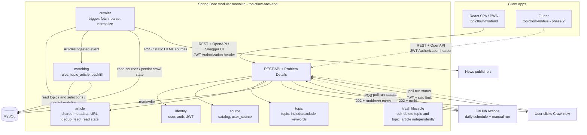

# TopicFlow (TFL) — Implementation Plan

> Portfolio project: a news aggregator organized by **topics** (include and exclude keywords), with optional news sources and read/unread tracking.
> - Jira key: **TFL**
> - Repo: `topicflow-backend` (Spring Boot + MySQL), `topicflow-frontend` (React SPA/PWA), `topicflow-mobile` (Flutter)
> - The backend is intended as a hands-on architecture learning project; the frontend will be built primarily with AI-assisted coding.

---

## 1. Goals and scope

### 1.1 Goals
- Build and deploy a working product to showcase Java/Spring backend skills on a résumé.
- Learn and demonstrate a modular monolith, ports and adapters, parallel crawling with virtual threads, idempotent jobs, internal events, pagination, testing, and CI.

### 1.2 MVP scope
- User registration and login (JWT).
- A news source catalog; users can select or deselect sources at any time.
- Topics: each topic can have multiple **INCLUDE** and **EXCLUDE** keywords; users can create multiple topics.
- Crawl daily on a schedule (GitHub Actions calls an endpoint); users can also click “Crawl now,” subject to rate limits. Store metadata only: title, snippet, original URL, thumbnail, publication time, and source. Users follow the link to read the article on the publisher’s site.
- Topic feeds with cursor pagination; opening an article launches its original page in an external browser.
- Read/unread controls: mark an article read or unread, or mark all articles in a topic as read.
- Topics and articles within topics have independent deletion lifecycles: each can be soft-deleted and restored separately, or removed permanently right away. Trash items are purged after 30 days; active articles are not deleted based on age. An article may appear in multiple topics; deleting it affects only its association with the current topic, not shared metadata or its presence in other topics.

### 1.3 Out of MVP (future work)
- Push notifications (FCM), alongside the Flutter phase.
- HTML parsers for multiple sources (RSS is preferred for the MVP).
- Elasticsearch, a separate crawling service, and a message queue (Kafka/RabbitMQ).
- Search, advanced ranking/recommendations, analytics, and LLM summaries.

### 1.4 Decisions
| Decision                                                                                                       | Rationale                                                                                                 |
|----------------------------------------------------------------------------------------------------------------|-----------------------------------------------------------------------------------------------------------|
| Modular monolith; **do not** split into NestJS and a separate database                                         | Less operational overhead, shared data, and no current scaling pressure                                   |
| Put the crawler behind an interface (port)                                                                     | Makes it easier to extract a standalone worker later                                                      |
| Crawl by **source**, not by user                                                                               | Each source is crawled once and matched for all users                                                     |
| Prefer RSS/sitemaps; use Jsoup for static HTML                                                                 | More stable and less prone to breakage                                                                    |
| GitHub Actions runs daily and calls an endpoint; “Crawl now” uses the same flow                                | Render Cron Jobs have a minimum charge; Free Web Services sleep when idle, so do not rely on `@Scheduled` |
| Store metadata, snippets, and original links only                                                              | Readers visit the publisher’s site; this limits storage and third-party content retained in the database  |
| Frontend: **React SPA (Vite + TypeScript) and PWA first**, Flutter after the frontend and backend are complete | Provides an early demo link, static hosting has no cold start, and Flutter is a later learning phase      |
| Do not use Next.js or React Native                                                                             | This is a personal feed behind login and does not need SSR/SEO; Flutter is already planned for phase 2    |
| Authenticate with JWT in headers, **not** browser cookies/sessions                                             | The SPA and Flutter app share one authentication mechanism                                                |
| Keep business logic (matching, read state, pagination) in the backend                                          | Flutter only needs to reimplement the UI                                                                  |

---

## 2. Architecture



Java base package: `com.<yourname>.topicflow`, with one subpackage per module as shown above.

### 2.1 Module boundaries
- Modules communicate only through public services/interfaces or events; **business logic must not join tables across modules**.
- `crawler` publishes an `ArticlesIngested` event; `matching` consumes and processes it.
- Enforce module boundaries with ArchUnit or Spring Modulith.

### 2.2 Crawl flow
1. GitHub Actions or a user calls the trigger. The backend persists a `QUEUED` `crawl_run` in MySQL and returns `202` with a `runId`. `202` means the request was stored and queued; crawling is not complete. If a run is already active, return that run or `409` as defined by the API contract; do not start a concurrent run.
2. A web process claims the run using a database lease and processes it in the background. On startup, the app also looks for unfinished runs with expired leases and resumes them.
3. Get the active sources selected by at least one user.
4. For each source, persist its status and attempt count, fetch and parse it, canonicalize URLs, and calculate `url_hash`. Save articles and the `ArticlesIngested` outbox event in the same transaction. The outbox dispatcher delivers the event at least once; matching handles it idempotently. Then mark the source complete.
5. GitHub Actions and the frontend poll status by `runId` until the run is terminal or the client times out. Polling keeps the Web Service awake while the job runs; a client timeout does not cancel the server-side run. If the host restarts, the next poll wakes the app and startup recovery resumes the run. If the host remains down, the run waits for the next request or trigger.
6. Once all sources finish, mark the run `SUCCESS`, `PARTIAL`, or `FAILED`. A source failure does not discard completed source results.

Requirements: jobs must be **idempotent** (retries do not create duplicates), checkpoints must persist per source, leases must prevent concurrent runs, ingest events must use a transactional outbox, and runs must recover after restarts. Outbox delivery is at least once, so the matching listener must be idempotent. A Free Web Service cannot guarantee continuous processing without requests; GitHub Actions polling is part of scheduled crawling.

### 2.3 Matching rules
- Normalize by lowercasing, removing Vietnamese diacritics, and collapsing whitespace. Match against `title + snippet`.
- An article matches a topic if **at least one INCLUDE** keyword matches and **no EXCLUDE** keyword matches.
- Match on **word boundaries** (so “ai” does not incorrectly match “mail”); multi-word keywords match as phrases.
- When a user changes keywords or adds a source, run a **backfill** to rematch articles from the last N days.

---

## 3. Data model concept (MySQL)

> **Planning sketch only — not the approved database design or executable DDL.**
> This section illustrates the entities and relationships currently expected by the product plan. It intentionally omits implementation details such as finalized foreign keys, constraints, column types, indexes, and migration ordering, and may change as requirements are implemented.
> Treat each Flyway migration delivered with its Jira ticket as the authoritative database design. Review and refine the schema with the relevant domain behavior and integration tests before merging that migration. Do not execute or copy this sketch directly into a database.

```mysql
CREATE TABLE users (
  id BIGINT PRIMARY KEY AUTO_INCREMENT,
  email VARCHAR(255) NOT NULL UNIQUE,
  password_hash VARCHAR(255) NOT NULL,
  created_at DATETIME(3) NOT NULL
);

CREATE TABLE source (
  id BIGINT PRIMARY KEY AUTO_INCREMENT,
  name VARCHAR(120) NOT NULL,
  type ENUM('RSS','HTML') NOT NULL,
  url VARCHAR(500) NOT NULL,
  parser_config JSON NULL,
  active BOOLEAN NOT NULL DEFAULT TRUE,
  last_crawled_at DATETIME(3) NULL,
  consecutive_failures INT NOT NULL DEFAULT 0
);

CREATE TABLE user_source (
  user_id BIGINT NOT NULL,
  source_id BIGINT NOT NULL,
  PRIMARY KEY (user_id, source_id)
);

CREATE TABLE topic (
  id BIGINT PRIMARY KEY AUTO_INCREMENT,
  user_id BIGINT NOT NULL,
  name VARCHAR(120) NOT NULL,
  created_at DATETIME(3) NOT NULL,
  deleted_at DATETIME(3) NULL,
  INDEX idx_topic_user (user_id),
  INDEX idx_topic_trash (user_id, deleted_at)
);

CREATE TABLE topic_keyword (
  id BIGINT PRIMARY KEY AUTO_INCREMENT,
  topic_id BIGINT NOT NULL,
  keyword VARCHAR(120) NOT NULL,
  normalized_keyword VARCHAR(120) NOT NULL,
  type ENUM('INCLUDE','EXCLUDE') NOT NULL,
  UNIQUE KEY uq_topic_kw (topic_id, normalized_keyword, type)
);

CREATE TABLE article (
  id BIGINT PRIMARY KEY AUTO_INCREMENT,
  source_id BIGINT NOT NULL,
  url VARCHAR(1000) NOT NULL,
  url_hash BINARY(32) NOT NULL UNIQUE,   -- SHA-256 of the canonical URL
  title VARCHAR(500) NOT NULL,
  snippet VARCHAR(1000) NULL,
  thumbnail_url VARCHAR(1000) NULL,
  published_at DATETIME(3) NULL,
  created_at DATETIME(3) NOT NULL,
  INDEX idx_article_source_pub (source_id, published_at)
);

CREATE TABLE topic_article (
  topic_id BIGINT NOT NULL,
  article_id BIGINT NOT NULL,
  matched_keywords VARCHAR(500) NULL,
  deleted_at DATETIME(3) NULL,             -- trash state for this article-topic association
  dismissed_at DATETIME(3) NULL,           -- removed from this topic; prevents backfill from restoring it
  PRIMARY KEY (topic_id, article_id),
  INDEX idx_ta_feed (topic_id, deleted_at, dismissed_at, article_id DESC)
);

CREATE TABLE user_article_state (       -- a row means read; no row means unread
  user_id BIGINT NOT NULL,
  article_id BIGINT NOT NULL,
  read_at DATETIME(3) NOT NULL,
  PRIMARY KEY (user_id, article_id)
);

CREATE TABLE crawl_run (
  id BIGINT PRIMARY KEY AUTO_INCREMENT,
  trigger_type ENUM('SCHEDULED','USER','RECOVERY') NOT NULL,
  requested_by_user_id BIGINT NULL,
  status ENUM('QUEUED','RUNNING','SUCCESS','PARTIAL','FAILED') NOT NULL,
  created_at DATETIME(3) NOT NULL,
  started_at DATETIME(3) NULL,
  heartbeat_at DATETIME(3) NULL,
  finished_at DATETIME(3) NULL,
  INDEX idx_crawl_run_recovery (status, heartbeat_at)
);

CREATE TABLE crawl_source_result (
  id BIGINT PRIMARY KEY AUTO_INCREMENT,
  run_id BIGINT NOT NULL,
  source_id BIGINT NOT NULL,
  status ENUM('PENDING','RUNNING','SUCCESS','FAILED','SKIPPED') NOT NULL,
  attempts INT NOT NULL DEFAULT 0,
  new_articles INT NOT NULL DEFAULT 0,
  started_at DATETIME(3) NULL,
  finished_at DATETIME(3) NULL,
  error_message VARCHAR(500) NULL,
  UNIQUE KEY uq_run_source (run_id, source_id),
  INDEX idx_crawl_source_resume (run_id, status)
);

CREATE TABLE crawl_lock (
  id TINYINT PRIMARY KEY,                  -- only row id=1 exists
  active_run_id BIGINT NULL,
  lease_until DATETIME(3) NULL
);
-- Seed one control row: id=1, active_run_id=NULL, lease_until=NULL.

CREATE TABLE outbox_event (
  id BIGINT PRIMARY KEY AUTO_INCREMENT,
  event_type VARCHAR(120) NOT NULL,
  aggregate_id BIGINT NOT NULL,
  payload JSON NOT NULL,
  created_at DATETIME(3) NOT NULL,
  processed_at DATETIME(3) NULL,
  attempts INT NOT NULL DEFAULT 0,
  last_error VARCHAR(500) NULL,
  INDEX idx_outbox_pending (processed_at, id)
);
```

Notes:
- Canonical URLs: remove tracking parameters (`utm_*`, `fbclid`, etc.) and fragments, and normalize the scheme/host.
- Active articles have no automatic retention period. Topics use `topic.deleted_at`; articles within topics use `topic_article.deleted_at`, so the two trash lifecycles are independent and scoped to the topic owner. Restore clears the timestamp within 30 days. After 30 days, opening the trash or a crawl can purge expired records in batches: delete an expired topic and its keywords/matches, or delete an expired `topic_article` association. Delete shared `article` metadata only when no associations remain and product policy allows it.
- Permanently removing an article from one topic sets the association tombstone `dismissed_at`, preventing backfill from adding it again. This does not delete shared metadata or associations with other topics.
- Durable crawling: `crawl_run` represents a request/run; `crawl_source_result` is the per-source checkpoint. Recover `QUEUED` or `RUNNING` runs whose heartbeat/lease has expired. Claim leases atomically in the database; do not hold a database lock during network fetches. Terminal runs are not restarted automatically; the next scheduled trigger creates a new run.
- The transactional outbox writes `ArticlesIngested` in the same transaction as article persistence. The dispatcher retries failures and delivers at least once; matching uses idempotent upserts so duplicate deliveries do not duplicate matches or lose updates.
- The Flutter phase will add a `device_token` table (`user_id`, `token`, `platform`) for push notifications.
- Add indexes as needed based on `EXPLAIN` results.

---

## 4. API (REST, mobile-first)

| Group            | Endpoint                                                                                                                             | Notes                                                                                                                                     |
|------------------|--------------------------------------------------------------------------------------------------------------------------------------|-------------------------------------------------------------------------------------------------------------------------------------------|
| Auth             | `POST /auth/register`, `POST /auth/login`, `POST /auth/refresh`                                                                      | JWT in the Authorization header                                                                                                           |
| Sources          | `GET /sources`                                                                                                                       | Catalog with the user’s `selected` flag                                                                                                   |
| Sources          | `PUT /me/sources`                                                                                                                    | Replace the selected source list                                                                                                          |
| Topics           | `GET/POST /topics`, `PUT/DELETE /topics/{id}`                                                                                        |                                                                                                                                           |
| Topics           | `PUT /topics/{id}/keywords`                                                                                                          | Send `include[]` and `exclude[]`                                                                                                          |
| Feed             | `GET /topics/{id}/articles?cursor=&limit=&unreadOnly=`                                                                               | Cursor pagination by `article.id`                                                                                                         |
| Feed             | `GET /feed?cursor=&limit=`                                                                                                           | Optional feed across all topics                                                                                                           |
| Read state       | `PUT /articles/{id}/read`, `DELETE /articles/{id}/read`                                                                              | Mark read / unread                                                                                                                        |
| Read state       | `POST /topics/{id}/read-all`                                                                                                         | Mark all as read                                                                                                                          |
| Crawl            | `POST /crawl`                                                                                                                        | JWT; user-triggered crawl returns `202` + `runId`; rate-limited                                                                           |
| Internal         | `POST /internal/crawl`                                                                                                               | Secret token for GitHub Actions; returns `202` + `runId` after persisting the request                                                     |
| Internal         | `GET /internal/crawl-runs/{runId}`                                                                                                   | GitHub Actions polls until the run is terminal or times out                                                                               |
| Crawl            | `GET /crawl-runs/{runId}`                                                                                                            | User views their run status                                                                                                               |
| Topic trash      | `GET /topics/trash`, `POST /topics/{id}/restore`, `DELETE /topics/{id}`                                                              | List, restore, or permanently delete a topic; `DELETE /topics/{id}` is permanent                                                          |
| Topic trash      | `POST /topics/{id}/trash`                                                                                                            | Move a topic to trash; retain its keywords/matches for 30 days                                                                            |
| Article-in-topic | `GET /topics/{id}/trash`, `POST /topics/{topicId}/articles/{articleId}/trash`, `POST /topics/{topicId}/articles/{articleId}/restore` | Per-topic trash for article associations; restore within 30 days                                                                          |
| Article-in-topic | `DELETE /topics/{topicId}/articles/{articleId}`                                                                                      | Permanently remove an article from the current topic while keeping a technical tombstone; shared metadata and other topics are unaffected |
| Ops              | `GET /actuator/health`                                                                                                               | Used by Render                                                                                                                            |
| API docs         | `/swagger-ui.html`, `/v3/api-docs`, JSON spec                                                                                        | Swagger UI and OpenAPI JSON; expose publicly only if configured safely, otherwise protect or disable in production                        |

Conventions: return errors in a consistent RFC 7807 Problem Details format. Keep feed responses concise (`id`, `title`, `snippet`, `thumbnail`, `source`, `publishedAt`, `isRead`, `url`). Configure CORS with an explicit allowlist for the SPA (and Flutter web, if used).

---

## 5. Hosting

> Render details are based on third-party documentation available when this plan was drafted (October 2026). **Verify current terms before deployment.**

**Backend (Render Free)**
- A Free Web Service sleeps after 15 minutes without requests and takes about one minute to cold-start. Each workspace gets 750 free instance hours per month.
- Free Web Services have no persistent disk and cannot run one-off jobs.
- Render’s free Postgres expires after 30 days, and no free managed MySQL tier is listed. Use an **external MySQL host** (verify provider free tiers) or consider changing databases.
- Strategy: use an external scheduler to wake the service (start with once daily; increase to 4–6 times per day if needed). **Do not** send continuous keep-alive pings.
- GitHub Actions calls the endpoint daily and can also be run manually. A Free Web Service sleeps after 15 idle minutes and takes about one minute to start. Do not use Render Cron if the goal is zero cost; it has a $1/month minimum per job.
- A `202` response confirms that `crawl_run` was durably stored and returns a `runId`. The process claims a database lease, runs in the background, and recovers queued or lease-expired runs at startup. GitHub Actions polls status to keep the service awake until the run is terminal; polling after a restart also wakes the service and triggers recovery. If the host remains down, the run resumes on the next request/trigger; completion is not guaranteed while no requests arrive.
- The Crawl Now button uses the same mechanism, and the UI polls run status. Apply per-user rate limits and a global lease to prevent spam and overlapping runs.

**Frontend**
- Build the SPA as static files and host it on a static hosting service (Vercel, Netlify, Cloudflare Pages, etc.; verify current free tiers). Static hosting does not have the backend’s cold start.
- Show a waiting state when the first API call wakes the backend (about one minute).

---

## 6. Java features and design patterns (tied to real use cases)

| Concept                                      | Where it is used                                                                                      | Interview discussion point                         |
|----------------------------------------------|-------------------------------------------------------------------------------------------------------|----------------------------------------------------|
| Virtual threads                              | Fetch multiple sources concurrently (`newVirtualThreadPerTaskExecutor`) with a per-domain `Semaphore` | I/O-bound workloads; compare with platform threads |
| Stream / Collectors                          | Parse → normalize → deduplicate → match pipeline; `groupingBy` by topic                               | Declarative pipelines that are easy to test        |
| Records, sealed interfaces, pattern matching | `CrawlResult = Success \| Failed \| Skipped`                                                          | Model states safely                                |
| Strategy + Registry/Factory                  | Select an RSS or HTML `SourceParser` by `source.type`                                                 | Add sources without modifying existing code (OCP)  |
| Template Method                              | Shared fetch → parse → map flow                                                                       | Reuse common process steps                         |
| Decorator                                    | Wrap `Fetcher` with retries, rate limits, and robots.txt checks                                       | Add behavior without changing the original class   |
| Chain of Responsibility / Pipeline           | Filtering steps: deduplicate → include → exclude                                                      | Keep steps separate and easy to add/remove         |
| Specification                                | Represent topic-matching rules                                                                        | Compose and test rules independently               |
| Observer / Domain event                      | `ArticlesIngested` → matching                                                                         | Reduce coupling between modules                    |
| Ports & Adapters                             | Put `crawler` behind an interface                                                                     | Prepare for extracting a worker later              |

Note: use a pattern only when it solves a concrete problem, and record the rationale in an ADR.

---

## 7. Time estimates

Assumption: one focused workday is about 4–5 hours. Two scope levels:
- **Lean**: a working deployment with auth, sources, topics, RSS crawling, matching, feeds, read/unread, and deployment. Fewer tests, no HTML parser, and a minimal README.
- **CV-grade**: adds tests and Testcontainers, full CI, Swagger UI/OpenAPI JSON, retries/rate limits/robots.txt, virtual threads and benchmarks, an HTML parser, README/ADRs/diagrams. Includes buffer time.

| Phase                                                                       | Lean (hours)                               | CV-grade (hours) |
|-----------------------------------------------------------------------------|--------------------------------------------|------------------|
| P0 Foundation (setup + basic CI)                                            | 4-6                                        | 6-8              |
| P1 Core domain: auth, sources, topics                                       | 16-22                                      | 22-30            |
| P2 Vertical crawler slice (RSS)                                             | 12-16                                      | 14-20            |
| P3 Matching + feed + read state                                             | 14-18                                      | 18-24            |
| OpenAPI/Swagger + JSON spec and contract CI                                 | 2-4                                        | 4-6              |
| P4 Triggers + deployment                                                    | 8-12                                       | 10-16            |
| P5 Crawler hardening (Strategy, retries/rate limits, virtual threads, HTML) | 0-4                                        | 16-26            |
| P6 Tests and documentation                                                  | 4-8                                        | 16-26            |
| **Backend**                                                                 | **~60-90**                                 | **~106-156**     |
| P7 React SPA/PWA frontend (AI-assisted)                                     | 15-25                                      | 20-35            |
| **Total (backend + React)**                                                 | **~75-115**                                | **~126-191**     |
| P8 Flutter (optional, excluded from total)                                  | 25-45 (plus Dart learning time, if needed) |                  |

Schedule estimate: at 4–5 hours/day, about 4–6 weeks (Lean) or 6–9 weeks (CV-grade); at 2 hours/day, multiply by roughly 2.5.

---

## 8. Detailed Jira story plan

How to read this section:
- Each item is a Jira story numbered `TFL-01`…`TFL-32` across backend, frontend, and mobile; `[BE]`, `[FE]`, and `[Mobile]` identify repository/scope. Implement each story in one PR; checkboxes are subtasks.
- Items marked **(CV)** are CV-grade only; unmarked items are included in both Lean and CV-grade.
- Tests for a feature belong in that feature’s PR.
- The numbering reflects dependencies and the earliest practical start. Frontend stories TFL-12…TFL-19 can begin right after TFL-11; backend stories TFL-20…TFL-28 can proceed in parallel because they do not block the API contract. Mobile stories TFL-29…TFL-32 follow the required frontend/backend milestones. The phases below group stories by scope; Jira numbers remain the priority/start order.

### P0 — Foundation (`topicflow-backend`)

**TFL-01 [BE] — Foundation + minimal CI**
- [ ] Repository, `.gitignore`, license, and README skeleton
- [ ] Spring Boot (Java 21+), build tool, and module-based package structure
- [ ] Docker Compose for local MySQL
- [ ] Flyway baseline
- [ ] `local` / `prod` profiles with environment-based configuration
- [ ] Shared, consistent error format (Problem Details)
- [ ] Add springdoc and Swagger UI for local/dev profiles; document each endpoint in its feature PR
- [ ] Basic GitHub Actions CI: build and run unit tests on every PR/push; cache dependencies
- [ ] No MySQL in CI yet; add a Testcontainers/MySQL integration stage in TFL-03 after TFL-02 adds the first migration and tests
- [ ] Module-boundary checks (ArchUnit/Spring Modulith)
- [ ] ADR-001: modular monolith; do not split services

### P1 — Core domain

**TFL-02 [BE] — Auth & users**
- [ ] `users` migration
- [ ] Registration/login and password hashing (BCrypt/Argon2)
- [ ] JWT access and refresh tokens in headers; security filter
- [ ] Set up a reusable MySQL Testcontainers base class for later PRs
- [ ] Tests: duplicate email registration, wrong password, expired token

**TFL-03 [BE] — CI integration-test profile** *(after TFL-02, before TFL-04)*
- [ ] Separate unit and integration tests using profiles/tags
- [ ] CI starts MySQL Testcontainers, runs Flyway migrations, and executes integration tests
- [ ] Retain logs/test reports on failure; do not store secrets or real data in artifacts

**TFL-04 [BE] — Sources**
- [ ] `source` and `user_source` migrations
- [ ] Seed 5–10 stable RSS sources
- [ ] `GET /sources` with the user’s `selected` flag
- [ ] `PUT /me/sources` (users can add/remove sources at any time)
- [ ] API tests

**TFL-05 [BE] — Topics & keywords**
- [ ] `topic` and `topic_keyword` migrations
- [ ] `TextNormalizer` (lowercase, remove diacritics, collapse whitespace) + unit tests (reused by matching)
- [ ] Topic CRUD (verify ownership)
- [ ] `PUT /topics/{id}/keywords` with include/exclude keywords and duplicate prevention
- [ ] Per-user topic/keyword limits
- [ ] Validation and access-control tests

*(If TFL-05 exceeds about 8 hours, split “topic CRUD” and “keywords + TextNormalizer” into two PRs.)*

### P2 — Vertical crawler slice

**TFL-06 [BE] — Fetch & parse (pure logic, no database yet)**
- [ ] `Fetcher` and `SourceParser` interfaces (ports)
- [ ] `HttpFetcher` (timeouts, User-Agent, response-size limit)
- [ ] `RssParser` → `ParsedArticle` (record)
- [ ] Canonicalize URLs and calculate `url_hash`
- [ ] Test the parser with a saved real-world RSS fixture; test URL canonicalization

**TFL-07 [BE] — Persist articles & run crawls**
- [ ] Migrations for `article`, `crawl_run`, `crawl_source_result`, `crawl_lock`, and `outbox_event`
- [ ] Persist articles and ignore duplicates (unique `url_hash`)
- [ ] Write `ArticlesIngested` to a transactional outbox in the same transaction; dispatcher retries with at-least-once delivery
- [ ] Orchestrator crawls selected sources sequentially and records `crawl_run` / per-source results
- [ ] Publish the `ArticlesIngested` event
- [ ] Internal runner/CLI to test one source end-to-end
- [ ] Integration test: two runs do not create duplicates (idempotency)

### P3 — Matching, feed, read state, and API contract

**TFL-08 [BE] — Matching rules (pure logic)**
- [ ] Specification: at least one INCLUDE and no EXCLUDE match
- [ ] Match on word boundaries; support phrases; normalize with `TextNormalizer`
- [ ] Table-driven tests (Vietnamese diacritics, short words, duplicates, exclude overrides include)

**TFL-09 [BE] — Connect matching to ingestion**
- [ ] `topic_article` migration
- [ ] Outbox listener for `ArticlesIngested`: find topics whose users selected the source, apply matching rules, and idempotently upsert `topic_article`
- [ ] Mark the event processed only after matching commits; retries must not create duplicates
- [ ] End-to-end integration test: crawl a fixture and verify the article appears in the correct topic

**TFL-10 [BE] — Feed & read state**
- [ ] `user_article_state` migration
- [ ] `GET /topics/{id}/articles` with cursor pagination, `unreadOnly`, and `isRead`
- [ ] `PUT/DELETE /articles/{id}/read`
- [ ] `POST /topics/{id}/read-all`
- [ ] Check `EXPLAIN` and add necessary indexes
- [ ] Test pagination for gaps/duplicates when new articles arrive
- [ ] Update Swagger annotations for feed/read endpoints

**TFL-11 [BE] — Export the OpenAPI JSON contract** *(M1: feed API and JSON contract are ready; frontend can start)*
- [ ] Review APIs from auth through feed: requests/responses, JWT bearer auth, pagination, Problem Details, and error responses
- [ ] Export a stable `docs/openapi.json` using a repeatable task/script; update it in the same PR whenever the API contract changes
- [ ] CI generates the spec and verifies it matches the committed file
- [ ] Ensure the spec has clear names/types for clean TypeScript and Dart client generation
- [ ] Keep Swagger UI in local/dev; disable or protect it in production

**TFL-20 [BE] — Backfill after keyword/source changes**
- [ ] Rematch articles from the last N days when keywords change or a source is added
- [ ] Tests: adding a keyword surfaces older articles; removing a source removes its articles from the feed
- [ ] Respect trashed/dismissed topic and article states; backfill must not restore them to the feed

### P4 — Triggers and deployment

**TFL-21 [BE] — Crawl triggers**
- [ ] Trigger durably creates a `QUEUED` `crawl_run` in the database, then returns `202` + `runId`
- [ ] In-process background worker atomically claims a database lease and renews its lease/heartbeat; do not hold a transaction/row lock during network fetches
- [ ] `crawl_source_result` records PENDING/RUNNING/SUCCESS/FAILED/SKIPPED, attempts, timestamps, and per-source errors
- [ ] On startup, resume QUEUED runs or RUNNING runs with expired leases; reset interrupted RUNNING sources to PENDING
- [ ] Provide a status endpoint; GitHub Actions and the frontend poll until terminal status or timeout
- [ ] Source failures produce PARTIAL; the next scheduled trigger creates a new run; ingestion is idempotent by URL hash
- [ ] Rate-limit user triggers; allow only one active crawl system-wide
- [ ] Test recovery after restart, expired leases, duplicate requests, repeated outbox delivery, and deduplication

**TFL-22 [BE] — Deploy the backend**
- [ ] Multi-stage Dockerfile and health check
- [ ] `prod` configuration; secrets from environment variables
- [ ] Choose an external MySQL host and configure a secure connection
- [ ] Deploy to Render
- [ ] Daily GitHub Actions `schedule` calls the internal endpoint using a secret stored in Actions Secrets; support manual workflow runs
- [ ] Workflow polls the status endpoint until terminal status/timeout to keep the Free Web Service awake during crawling
- [ ] The app’s “Crawl now” button calls the user-authenticated endpoint, polls status, and is rate-limited
- [ ] Structured logs and a correlation ID for each crawl run
- [ ] Monitor workspace instance hours and bandwidth; daily scheduling is a starting point, not a guarantee that other workspace traffic will stay within the free allowance
- [ ] Document deployment in the README; note that GitHub Actions schedules can be delayed and Render Cron Jobs cost at least $1/month

**TFL-23 [BE] — Delete topics and articles within topics**
- [ ] Soft-delete topics and individual article-topic associations independently; each has its own trash and restore flow
- [ ] Feeds exclude trashed topics and trashed/dismissed article associations
- [ ] Permanently remove a topic or article item from a topic; retain a technical tombstone for article items to prevent backfill from recreating them; do not delete shared article metadata while associations remain
- [ ] Batch-purge topics/associations after 30 days when trash is opened or during a crawl; no separate cleanup cron is needed
- [ ] Ensure matching/backfill does not restore dismissed associations
- [ ] Test ownership, independent trash lifecycles, restoration, expiry, and shared data

### P5 — Crawler hardening **(CV)**

**TFL-24 [BE] — Refactor Strategy/Template (no behavior change)** **(CV)**
- [ ] Registry selects a parser by `source.type` (Strategy + Factory)
- [ ] Template Method for the fetch → parse → map flow
- [ ] Model `CrawlResult` as a sealed interface + `switch` pattern matching
- [ ] Existing tests continue to pass unchanged
- [ ] ADR explains the rationale

**TFL-25 [BE] — Fetch resilience** **(CV)**
- [ ] Decorators for retries (backoff), per-domain rate limits, and robots.txt checks
- [ ] Temporarily disable repeatedly failing sources (`consecutive_failures`)
- [ ] Test each decorator (simulate errors/timeouts)

**TFL-26 [BE] — Parallel crawling with virtual threads** **(CV)**
- [ ] Virtual-thread executor + per-domain `Semaphore`
- [ ] Verify safe concurrent database writes (correct deduplication, no deadlocks)
- [ ] Benchmark N sources: platform threads vs. virtual threads; record results in `docs/`
- [ ] ADR

**TFL-27 [BE] — HTML parser (Jsoup)** **(CV)**
- [ ] Configure `HtmlParser` selectors via `parser_config` for 1–2 sources
- [ ] Real-world HTML fixtures and parser tests
- [ ] Document the risk of parsers breaking when a source changes its structure

### P6 — Polish

**TFL-28 [BE] — Documentation & quality** *(Lean: minimal README only)*
- [ ] README: goals, local setup, and deployment
- [ ] Architecture and crawl-flow diagrams **(CV)**
- [ ] 3–5 short ADRs (monolith, external scheduler, metadata-only storage, matching, database host) **(CV)**
- [ ] CI badge and test-coverage report **(CV)**
- [ ] Micrometer + Actuator crawl metrics: duration, source success/failure, new articles, active jobs (avoid high-cardinality labels such as URL/user ID)
- [ ] Minimal Grafana dashboard and alerts for repeated crawl failures or missed scheduled crawls; document setup in the README **(CV)**
- [ ] Clean up code/naming and resolve TODOs or create tickets for them

### P7 — React SPA/PWA frontend (`topicflow-frontend`)

**TFL-12 [FE] — Scaffold**
- [ ] Vite + React + TypeScript, lint/formatting, and CI build
- [ ] Generate a TypeScript client from `openapi.json`
- [ ] Environment configuration (API URL) and mobile-first layout

**TFL-13 [FE] — Auth**
- [ ] Login/registration screens
- [ ] Store tokens, refresh automatically, and guard routes

**TFL-14 [FE] — Source selection**
- [ ] Source list with select/deselect controls

**TFL-15 [FE] — Topics & keywords**
- [ ] List, create, and edit topics; manage include/exclude keywords
- [ ] Soft-delete topics; view topic trash; restore or permanently delete topics
- [ ] Integrate deletion using TFL-23 APIs; update the generated client after the backend OpenAPI contract is merged

**TFL-16 [FE] — Feed & read state**
- [ ] Topic feed with cursor-based infinite scrolling
- [ ] Open article links in a browser; mark read/unread; mark all as read
- [ ] Soft-delete an article from a topic; view article trash; restore or permanently delete it without affecting other topics
- [ ] Integrate TFL-23 APIs; regenerate the client after the backend contract is merged
- [ ] Filter to unread articles only

**TFL-17 [FE] — States & user experience**
- [ ] Loading/error/empty states on every screen
- [ ] “Crawl now” button, crawl status, and polling by `runId` (depends on TFL-21 API)
- [ ] Waiting screen while the backend cold-starts (~1 minute)
- [ ] Check responsive layout on narrow screens

**TFL-18 [FE] — Deploy the frontend**
- [ ] Build static assets and deploy to static hosting
- [ ] Configure backend CORS for the deployed domain

**TFL-19 [FE] — PWA** **(CV)**
- [ ] Manifest + service worker; “add to home screen” support
- [ ] Add demo screenshots/GIF to the README

### P8 — Flutter (`topicflow-mobile`, optional after frontend/backend)

**TFL-29 [Mobile] — Scaffold**: Flutter project, CI, and Dart client generated from `openapi.json`.
**TFL-30 [Mobile] — Auth**: login/registration, secure token storage, and automatic refresh.
**TFL-31 [Mobile] — Sources & topics**: select sources, topics, and keywords.
**TFL-32 [Mobile] — Feed & read state**: cursor-based feed, open links, mark read/unread.
**Push (paired PRs, in order)**:
- [ ] `topicflow-backend`: `device_token` table, token registration API, and FCM delivery for new topic matches *(merge + deploy first)*
- [ ] `topicflow-mobile`: register tokens, receive notifications, and open articles from them
- [ ] Daily email digest (separate from FCM): user opt-in, schedule, duplicate-send prevention, and email-provider configuration

---

## 9. Branch and PR rules

1. **One Jira story = one PR / one independently mergeable slice.** `main` must always build and run.
2. Keep these changes in the **same PR**:
   - migration + entity/repository for that table;
   - endpoint + validation + tests + OpenAPI updates;
   - architecture decision + its ADR;
   - utilities used only by that slice (e.g. `TextNormalizer` with the keyword PR).
3. **Use separate PRs for:**
   - behavior-preserving refactors (TFL-24), separate from new features;
   - pure logic (parsing, matching rules) separate from persistence/wiring when substantial;
   - infrastructure (CI, Docker, deployment, cron) separate from business logic;
   - separate repositories use separate PRs.
4. **Size:** target 3–8 hours of work and fewer than ~400–500 changed lines (excluding generated files, seeds, and fixtures). Split larger changes along *pure logic → persistence → API* boundaries.
5. **Cross-repository contract:** merge the backend PR and update `openapi.json` **first**; frontend/mobile then regenerate their clients in their own PRs. Do not change the API and its client in the same PR when repositories are separate.
6. **Jira:** each `TFL-xx` heading is a story; use the same key in the PR title and link the story. Checkboxes are subtasks. Close the story when the PR is merged and meets the Definition of Done.
7. **Definition of Done for each PR:**
   - [ ] Build and tests pass in CI
   - [ ] Migration runs against an empty database
   - [ ] OpenAPI matches the code (when APIs change); CI checks that the JSON spec is not stale
   - [ ] README/ADR updated for new decisions
   - [ ] No TODOs without a tracking ticket

---

## 10. Résumé-ready checklist

- [ ] Working demo link (or short video/GIF with a note about cold starts)
- [ ] README: goals, architecture, local setup, deployment
- [ ] Architecture and crawl-flow diagrams
- [ ] ADRs explaining key decisions
- [ ] Green CI with Testcontainers
- [ ] Measured results (virtual-thread benchmark, articles/second, crawl time for N sources)
- [ ] Swagger UI available in an appropriate environment; `docs/openapi.json` is versioned and checked by CI
- [ ] State that the frontend is a demo layer (AI-assisted); the focus is the backend
- [ ] Prepare 5–7 interview answers: why a monolith, deduplication, idempotency, virtual threads, external scheduling, Vietnamese matching, and handling source layout changes

---

## 11. Risks and mitigations

| Risk                                        | Mitigation                                                                                                                                 |
|---------------------------------------------|--------------------------------------------------------------------------------------------------------------------------------------------|
| HTML parsers are fragile and time-consuming | Use 5–10 RSS sources for the MVP; keep HTML for CV-grade work                                                                              |
| Cold starts slow the demo                   | Show a waiting screen in the frontend; include a video/GIF and README note                                                                 |
| Exhausting the 750 free hours               | No keep-alive; scheduled Actions and user traffic both consume hours while the service runs; monitor workspace usage                       |
| Free MySQL expires or has storage limits    | Monitor storage, purge trashed items, and prepare to switch providers                                                                      |
| Copyright/legal issues                      | Store metadata and original links only; respect robots.txt and rate limits                                                                 |
| Incorrect matches (short words, Vietnamese) | Use word-boundary matching and table-driven tests                                                                                          |
| Scope creep                                 | Keep an out-of-MVP list; add items only after the vertical slice works                                                                     |
| Frontend drifts from the API                | Configure Swagger UI in TFL-01 and update it with each endpoint; finalize/version the JSON in TFL-11 before generating the frontend client |
| PRs are too large to review                 | Apply size guidelines and split along pure logic/persistence/API boundaries                                                                |

---

## 12. Milestones

| Milestone | Outcome              | Completion criteria                                                                                                                             |
|-----------|----------------------|-------------------------------------------------------------------------------------------------------------------------------------------------|
| M1        | API contract ready   | Complete TFL-01…TFL-11: auth/sources/topics/RSS crawl/feed work, Swagger annotations are complete, and `docs/openapi.json` can generate clients |
| M2        | MVP backend complete | Complete TFL-20, TFL-21, and TFL-23: backfill, durable triggers, multiple sources/topics, read state, and independent trash lifecycles          |
| M3        | Running in the cloud | Complete TFL-22; scheduled crawling and TFL-21 recovery run reliably for at least one week                                                      |
| M4        | React frontend demo  | Complete TFL-12…TFL-18; integrate TFL-21 trigger and TFL-23 trash APIs after the backend contracts merge; main flows work on a phone            |
| M5        | Résumé package       | Complete TFL-24…TFL-28 and TFL-19: README, ADRs, benchmarks, and demo link/video                                                                |
| M6        | Flutter (optional)   | Complete TFL-29…TFL-32; add push notifications if desired                                                                                       |

## 13. Post-MVP backlog (ranked by résumé value per effort)

1. **Observability** (estimated 6–10 hours): Micrometer + Actuator, crawl metrics, a minimal Grafana dashboard, and alerts for repeated source/run failures. A health endpoint does not replace metrics.
2. **Basic feed ranking**: score by freshness, number of matched keywords, and source trust/priority; explain the score and evaluate it on fixtures before personalization.
3. **Near-duplicate detection** (estimated 10–15 hours): use SimHash on titles/snippets; store fingerprints and candidate groups while retaining each source’s original article. Measure precision/recall on a sample set before automatically merging.
4. **Search** (estimated 10–15 hours): start with MySQL FULLTEXT and the ngram parser; evaluate quality on Vietnamese text before considering Elasticsearch/OpenSearch.
5. **FCM + email digest**: implement FCM with Flutter; treat email digest as a separate feature with opt-in, scheduling, and duplicate-send prevention. The earlier 10–15-hour estimate covers only a minimal scope and should be revisited based on the provider and opt-in flow.
6. **Keyword recommendations** from read articles: suggest keywords for user approval rather than editing topics automatically; define how usefulness will be measured first.
7. **Separate crawl worker + queue** (estimated 20–30 hours for an initial slice): add RabbitMQ/Kafka only when load or operational needs justify it; include retries, DLQ, idempotency, metrics, and the rationale for keeping a monolith until then. The estimate may increase if operations are included.
8. **Redis**: add feed caching/rate limiting only after profiling identifies a bottleneck and benchmarks show a benefit.
9. **LLM summaries**: experiment last, using snippets that may be sent to the service; control cost, usage rights, and data processing; do not store full article text.
10. Add HTML parsers for more sources, prioritizing source stability and practical value.
